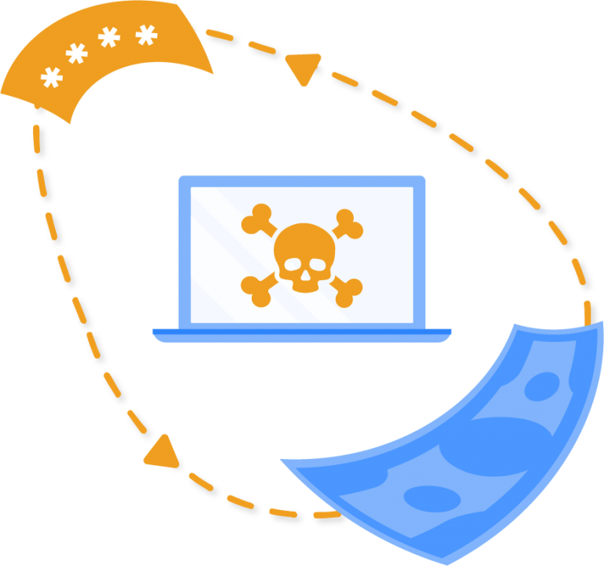
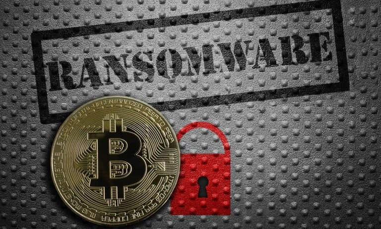
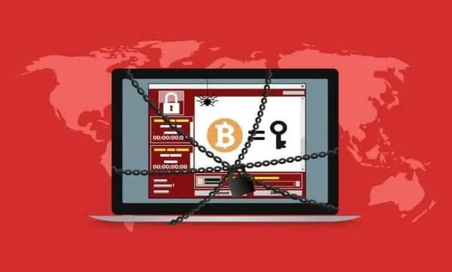

<br/>
<p align="center">
  <a href="https://github.com/ShaanCoding/ReadME-Generator">
    
  </a>

  <h3 align="center">Ransomware</h3>

  <p align="center">
    A Simple ransomware
    <br/>
    Note this project is done.
    <br/>
    <br/>
    <!-- <a href="https://readme.shaankhan.dev"><strong>View Demo »</strong></a> -->
    <br/>
    <br/>
    <a href="https://intsagram.com/error._.fiat">Our instagram page</a>
    .
    <a href="https://youtube.com/error_fiat">Our youtube chanel</a>
    .
    <a href="https://twitter.com/ErrorFiat">Our twitter page</a>
  </p>
</p>

## File`s in the folder

- Luncher.cs
- ransomware.cs

## What is ransomware?

> Ransomware is malware that encrypts your data. A protected private key can make your files readable once again. But hackers usually won't give you that key unless you give them something in return. A ransomware attack is always serious and some organizations are ready to pay anything to get their files back. But you can close the vulnerabilities that expose you to a ransomware attack and take immediate steps to recover if you've been hacked.

You click again and again but you can't see your files. Instead you will see a threatening message asking you for money! What has happened? You are probably dealing with a ransomware.

To execute an attack, hackers install malicious software on your system. All you will see is a message asking for money. You have to pay to get access to your files again.

Ransomware may include the following:

- A dark screen   -> You click on your files and everything goes black. All you see is a demand for money or a set of instructions.
- Endless pop-ups -> Your device is full of pop-ups containing messages, videos or immoral content.
- Device failure  -> Some devices won't turn on at all, or make horrible noises that you can't stop.

The first documented ransomware attack occurred in 1989 and became very common in 2012. By this point, millions of people have faced such an attack.

## How does a ransomware attack work?

Hackers are smart and have different tricks they can use against you. Ransomware attacks come from normal, everyday activities that you may never suspect or think twice about.

Ransomware is usually launched through one (or both) of the following two methods:

- Manual deployment. Here, a hacker gains administrative access to a system and installs ransomware on target systems.
- Automatic deployment. A system is compromised and ransomware is installed through the system.

Your servers may be infected through:

- Pop-ups
You are visiting a website and you see a page that informs you that you have been infected with a virus. The message says to click a button to remove the threat.

- Email messages
A note will be sent to you via email saying that you have won money or that you need to confirm receipt of a product. You will be shown a button to click.

- Phishing
A website you visit often gets hacked. While the conditions are very similar to your previous visits, tapping the buttons will lead to unexpected behaviors.

 

When you engage with the temptations set by the hacker, your clicking will lead to the installation of malware. You may not realize it's happening, but your computer will make a new friend that will quickly encrypt all your files so you can't access them.

When the program is complete, you will be shown a message asking for money. Ransom amounts vary, but most hackers ask people for a small amount. They may charge you $400 to get your files back.

Large companies with many cases see a much higher demand for money. It is not uncommon to encounter requests for thousands of dollars, and the hacker may ask you to pay in Bitcoin.



## Ransomware recovery and removal

Ransomware attacks can simply be seen as simple extortion attempts. Unfortunately, most hackers use sophisticated tools that are nearly impossible to replicate or defeat.

If you are attacked, experts recommend these steps:

1. Restart. Use Windows Safe Mode when restarting.
2. Scan. Click on any antivirus program you have and run as many tests and cleanup functions as possible.
3. Restore. If you still can't access the files, roll back to your last saved version.
If the malware originates from the server, any steps one takes will not help. If your entire company's system is down, the IT team must step in to fix the problem. All users must be logged off while the IT team cleans viruses and restores files.



## Could you be the target of a ransomware attack?
Anyone with a working computer and a collection of files can be a target for hackers. You may think you have nothing to share, but a hacker wants your money. However, a large number of hackers focus exclusively on large targets, including large companies and organizations.

Hackers can target organizations that have:

Sensitive files. Healthcare organizations must keep records secure or risk their credibility. Ransomware can put the entire organization's future at risk.
Significant demand. Government agencies and other similar organizations need 24/7 access to function. The ransom can be paid quickly in this environment.
Compromised information. Financial organizations and security companies have a lot of information about their customers. Data protection here can be critical to staying safe in business.
Analysts predict that in the future we can enter a new wave of ransomware attacks. Hackers can create a simple tool (such as a universal email) and attract hundreds or thousands of victims at once. Large companies will pay more than $1 billion for data recovery.

Many companies have been victims in the past. In 2017, in one of the most notorious ransomware attacks, over 200,000 computers in over 150 countries were attacked with the WannaCry ransomware variant. Hackers made a lot of money and many companies that didn't pay the ransom lost their files.

## How to manage ransomware attack?

If you've been tempted to pay hackers to get your files back, you're not alone. But government institutions do not recommend this method. Your payments encourage hackers to target others in the future. Also, many attackers demand more money when they realize that an organization is willing to pay the ransom.

Instead, experts recommend the following four-step recovery plan.

1. Report. Report this issue to the relevant legal entity. Ransomware attacks are a criminal event and the authorities must intervene if necessary.
2. Clean up. Ask an experienced consultant to help you recover your files.
3. Phase back. Restore infected systems to normal performance levels as work progresses.
4. Communicate. Contact any of your business partners who may have been infected as part of the attack.


Each company has a different recovery schedule. Your files can be cleaned, malware removed, and systems up and running in just a few days. For other companies, this may take months or even years.

## Prevent ransomware before it starts running!



Cleaning up after an attack is not so easy and you may lose some of your files and data forever. So prevention is a better strategy because you can stop attackers before they start.

The Cyber Security and Infrastructure Security Agency has a 16-page manual with instructions for companies that want to strengthen the security of their systems and prevent the next attack. Most of these tips are related to software.

Software should not be static. Companies release patches to mitigate vulnerabilities and prevent hacking attempts, but they won't help if you don't apply them. Make sure you are always reviewing all assets in your organization and applying update rules.

Your job is technical, but blocking an attack can also involve common sense actions that everyone in your organization must take. Hold training sessions with your staff and discuss the following:

The best email safeguards: Remind your team to avoid clicking on embedded links in email, especially if the notes come from someone outside the organization.
Privacy: Emphasize the importance of keeping usernames and passwords confidential.
Software: Emphasize that antivirus scanners keep the entire company safe and that these systems should be allowed to do their jobs.
Backup: In the event of a hack, reverting to backups may save you more time and trouble. Encourage your team to follow archival practices carefully.
If your team understands the threats you face, you may have more eyes and ears to look after the attack. If they notice a problem, you can stop it before it spreads.

## Getting Started

This is an example of how you may give instructions on setting up your project locally.
To get a local copy up and running follow these simple example steps.

### Prerequisites

This program has no pre-requisites

### Installation

1. Clone the repo

```sh
git clone https://github.com/errorfiathck/ransomware.git
```

2. Have fun!
